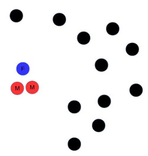
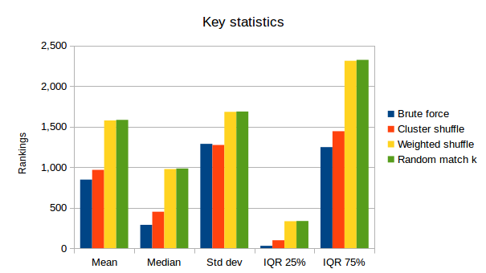

% Optimising partner matching for microsimulations of the HIV epidemic
% Nathan Geffen
% March 24, 2015

## Introduction

Microsimulation is a way of modelling epidemics that is growing in popularity. Instead of the traditional way of building a model consisting of differential equations and then solving them, a microsimulation consists of, perhaps, thousands of agents, each representing a person, and each behaving according to a simple set of rules. Instead of outputs like infection and mortality rates being derived from equations, they are derived from the interactions of the agents over many iterations.

<aside markdown="1">The terms *microsimulation* and *agent based modelling* describe very similar things. It is also not easy to find clear explanations of what the differences are between the two techniques. My understanding is that a microsimulation is an agent-based model whose parameters are initiated based on real-world data. Microsimulation is the term used in most literature on the HIV epidemic, and so that is what I will stick to here.</aside>

Microsimulations are much more computationally intensive than  traditional equation-based models but they have some characteristics that make them attractive. They are stochastic: randomness is built into them, and this is sometimes desired. While simple models are usually easier to implement as a set of differential equations, as the number of variables increases and models become increasingly complex, equation-based models become unwieldly and ultimately impractical. Yet you can make the rules of each agent in a microsimulation quite complex without much difficulty, and the microsimulation, if designed well, will scale. Microsimulations also allow you to examine what happens to specific agents or groups of agents more easily than equation-based models. Equation-based models do allow a population to be broken down into different compartments, but having multiple compartments can quickly become unmanageable.

## How microsimulations work

Microsimulations can model events in discrete or continuous time. I am primarily concerned with discrete microsimulation, but key principles are for the most part the same between them, and while I am not yet sure, I suspect and hope that most of what is presented here will work for continuous microsimulations as well.

At the beginning of the simulation you initialise a population of agents with information. So if you are simulating the HIV epidemic you might give each agent an initial age, HIV infection status, sex, a parameter describing how often they form new sexual partnerships. If this is a microsimulation as opposed to agent-based modelling, the agents will be initialised with data which matches real-world data, maybe with some stochastic noise added.

Then in a discrete microsimulation, you decide on a time-step, say one day, one week or one month. You also decide how many time-steps you wish to run the simulation for. So if your time-step is one month and you want to execute the simulation for 20 years, the simulation will run for $20 \times 12 = 240$ iterations. Each iteration involves interactions of agents and events. Examples of events are *DIE*, which determines if it is an agent's turn to die, *INFECT* which determines if it is an agent's turn to become infected with, say, HIV, *MATCH*, which finds a new sexual partner for an agent, or *BIRTH* which decides whether or not an agent is to give birth to a new agent. So on each iteration, the simulation steps through every agent and applies events to it. At the end of the simulation, you'll hopefully have interesting information like life-expectancy of the simulated population and the changes in the HIV prevalence and incidence rates over time.

This is a typical structure of a discrete microsimulation. Variations are possible, including swapping lines 2 and 3.

~~~~~~~~~{#mycode .python .numberLines startFrom="1"}
for each time-step
	for each event E
		for each agent A
			if E should be applied to A
				apply E to A
~~~~~~~~~

We are particularly interested in lines 3 to 5. The event applied in line 5 can either be a simple operation that considers only agent A, or it can be more complicated and consider a range of agents (maybe even all the other agents) with respect to A. The former will typically be fast, the latter is often slow.

## Fast versus slow events

Let's consider the *DIE* event. On an iteration, it will be checked to see if it must be applied to every living agent. Assume a particular agent has a risk of dying in a given month of $1\%$ of $0.01$, and assume each iteration corresponds to a month. Then the DIE event generates a uniform pseudo-random number on the semi-open range $[0, 1)$. If the random number is less than $0.1$, the agent dies, else it lives on another month.

The time that it takes *DIE* to execute is a function of the number of agents, $n$. In fact here it is directly proportional to the number of agents. The time taken, $T$, is equal to n times a constant, $c$.

$$T = cn$$

For comparing events, the constant $c$, the time taken for the small set of  operations that carry out the event's work, is tiny. We can dispense with it from hereon.

Now consider the *MATCH* event. This is the partner matching algorithm of the title of this article. Like the *DIE* event it is checked against every living agent on an iteration to see if it must be applied.  A subset of agents will need to be paired with new sexual partners. Let's assume the random number generator shows that agent, $A$, should find a new partner. We could then look through the remaining agents to find the most suitable match for $A$.

For simplicity let's assume every agent is in the market for a new partner. Then for the first agent, $A$, the *MATCH* event will look through the remaining *n-1* agents to find a match. Let's assume it matches $A$ with agent $D$. Then for the next agent, let's call it $B$, *MATCH* will look through *n-2* agents to find the most suitable match, including $D$ who will be rejected as a suitable match for $B$ because it is already matched to $A$.

In general, assuming all agents need to be matched, the execution time, $T$, over $n$ agents, for *MATCH* is proportional to

$$T = [ (n - 1) + (n - 2) + (n - 3) + ... + 3 + 2 + 1 ]$$.

This can be rewritten as:

$$T =  \sum_{i=1}^{n-1} i = \frac{n(n-1)}{2} =  \frac{n^2-n}{2}$$

Examine this table to see how much faster the *DIE* event is than the *MATCH* event.

| Agents (n) |     $n$   | $\frac{n^2-n}{2}$   |
|-----------:|----------:|--------------------:|
|         10 |        10 |                  45 |
|        100 |       100 |               4,950 |
|      1,000 |     1,000 |             499,500 |
|     10,000 |    10,000 |          49,995,000 |
|    100,000 |   100,000 |       4,999,950,000 |
|  1,000,000 | 1,000,000 |     499,999,500,000 |

As you can see, as we increase the number of agents in our simulation, the *MATCH* event has to do an ever greater amount of work than the *DIE* event and becomes much slower. You might respond that not all agents need to be matched. Well, let's say it's only 5% of agents. Now our equation is:

$$\frac{n^2-n}{40}$$

As the table shows it doesn't change the fact that the *MATCH* event is still very slow:

|     $n$    |    $\frac{n^2-n}{2}$   |   $\frac{n^2-n}{40}$  |
|-----------:|-----------------:|----------------:|
|         10 |               45 |               2 |
|        100 |            4,950 |             248 |
|      1,000 |          499,500 |          24,975 |
|     10,000 |       49,995,000 |       2,499,750 |
|    100,000 |    4,999,950,000 |     249,997,500 |
|  1,000,000 |  499,999,500,000 |  24,999,975,000 |

The $n^2$ term of the formula for the number of operations *MATCH* performs dominates. In computer science, to simplify our discussions of how efficient an algorithm is, we usually dispense with smaller terms like $n$ and constants such as $1/40$. We can do this formally by defining classes of functions called big $O$. Each class is of the form: $O(f(g))$.

We say that *MATCH*'s *asymptotic efficiency class* is $O(n^2)$ while the asymptotic efficiency class of *DIE* is $O(n)$.

The [formal definition of big O](http://xlinux.nist.gov/dads/HTML/bigOnotation.html) is:

> $f(n) = O(g(n))$ means there are positive constants $c$ and $k$, such that $0 \leq f(n) \leq cg(n)$ for all $n \geq k$, $c$ and $k$ are constants.

This definition removes the need for constants and smaller terms. For example $O(2n^2 - 10n) = O(n^2)$.

We are interested in algorithms that fit into three big $O$ classes: $O(n)$, $O(n \log n)$ and $O(n^2)$. The following table shows the difference in efficiency between them:

|     $n$    | $n \log{n}$ |        $n^2$       |
|-----------:|--------------:|-------------------:|
|         10 |            33 |                100 |
|        100 |           664 |             10,000 |
|      1,000 |         9,966 |          1,000,000 |
|     10,000 |       132,877 |        100,000,000 |
|    100,000 |     1,660,964 |     10,000,000,000 |
|  1,000,000 |    19,931,569 |  1,000,000,000,000 |

Note that although the log calculations use base 2, we omit the base in big O syntax because $\log_{2}{n}$ and $\log_{10}{n}$ differ by a constant.

This graph shows the differences in the gradients of these three efficiency classes:

## Why the efficiency class of events is important

The efficiency class of *DIE* for a single time step (or iteration) of the simulation is $O(n)$. This is usually the best we can hope for any event that must be applied to all the agents. Unfortunately the *MATCH* algorithm is much slower. Its efficiency class is $O(n^2)$. On the microsimulation I have worked on, *MATCH* is the bottleneck, the slowcoach that makes the microsimulation run slowly.

How slowly? Well consider this:

Let's say we set our time-step to a month, we have 20,000 agents and we want to simulate the HIV epidemic over 20 years. Let us further say that by the word operation we mean each time an agent is examined by our program. The *DIE* event then executes just under 4.8 million operations. Our *MATCH* algorithm by contrast performs nearly 48 billion operations. It's about ten thousand times slower than the *DIE* event.

<aside markdown="1">

#### An $O(n)$ algorithm is much faster than an $O(n^2)$ one

  

  <svg id="svg1" style="width:90%; height: 100px; display:none;">
    <circle id="c0_0" cx="40" cy="40" r="15" stroke="black"
	    stroke-width="2" fill="white" />
    <text id="t0_0" x="35" y="43" font-family="sans-serif"
	  font-size="12px" fill="black">0</text>
  </svg>
  

  <input class="alg-exec" id="nevent-button"
	type="button" value="Show algorithm for O(n) event"
         onclick="nEvent()"/>
  

  

  

   <svg id="svg2" style="width:90%; height: 100px; display:none;">
    <circle id="c1_0" cx="40" cy="40" r="15" stroke="black"
	    stroke-width="2" fill="white" />
    <text id="t1_0" x="35" y="43" font-family="sans-serif"
	  font-size="12px" fill="black">0</text>
   </svg>
     

		<input class="alg-exec" id="nsqevent-button" type="button"
			value="Show algorithm for O(n&sup2;) event"
			onclick="nsqEvent()"/>
	

  

</aside>

Even so, this is not catastrophic. Modern computer hardware is extremely fast, and if we code in C or C++ and run the entire simulation once using the *MATCH* algorithm as described above, it will takes several minutes on a mid-range PC. But nearly all this time taken is spent executing  the *MATCH* algorithm.

## Monte Carlo simulation

But here is the problem. We want to say what the 95% confidence intervals are for our outputs, such as life-expectancy and infection rates. To do this we need to use [Monte Carlo methods](http://www.mimuw.edu.pl/~apalczew/CFP_lecture4.pdf). This involves running our simulation over and over again with different values generated each time for its random variables. In fact we need to run the simulation tens of thousands of times.

Now if it takes five minutes to run a single simulation (in a simulation I worked on it took quite a bit longer with our first attempt at partner matching), then running it only 10,000 times takes 34 days, which is a long time to wait for results. And 10,000 might not be enough. If we want to stochastically perturb all the model's dependent variables, we might need to run the simulation many tens of thousands of times.

This is so slow that to date there are no published microsimulations of the HIV epidemic that have published confidence intervals using Monte Carlo simulation.

My colleague, Leigh Johnson, with a tiny bit of assistance from me, managed to get the length of a single simulation down to less than 30 seconds on fast hardware. Now running a few simulations in parallel, it takes Johnson several days to generate confidence intervals.

This is manageable, but there are three challenges I would like to overcome:

1. Bringing the time of a single simulation down even further might allow Monte Carlo simulation to be run conveniently as a matter of course on mid-range PCs.

2. The *MATCH* event in Johnson's model has been implemented in a very domain specific way and is extremely complex. The methodology proposed here for partner matching is, I suspect, of greater general application, that can be explained more easily to other modellers who wish to try their hand at simulating the HIV epidemic as well as other diseases.

3. If partner matching can be sped up, it might become more feasible to program microsimulations in high-level programming languages such as R or Javascript (though there is an [R package](https://statnet.csde.washington.edu/trac/raw-attachment/wiki/Resources/STERGMtutorial.pdf) for simulating sexual networks). Using Javascript opens the possibility for web-based visualisations of microsimulations of the HIV epidemic, which as far as I am aware is not currently practical.

Partner matching is vital not just in HIV simulation. If, for example, we want to simulate contagious diseases, then the risk of an agent becoming infected is related in part to the number of infected agents they come into contact with. Determining who and how many infected agents a particular agent is in contact with is similar to having to find multiple partners. The algorithms I present here can be modified without much difficulty to accommodate this.

The remainder of this article deals with how to optimise partner matching.

## Partner matching

In 2013, Johnson [implemented and compared two models of sexually transmitted infections](http://nathangeffen.webfactional.com/viennaposterfinal.pdf), a deterministic equation-based model and a microsimulation. The two models were materially identical except that the latter implemented a complex partner matching algorithm. The details of the algorithm used are complex and only partly relevant to this discussion. Here are the relevant details:

- Agents are either male or female.
- All agents are heterosexual. (This makes finding efficient partner formation algorithms difficult, as we shall see.)
- Agents have different risk profiles for HIV.
- Agents can be married or not married.
- The usual time-step for the simulation is one week.
- Each time-step, all agents are examined to determine if they would form new partnerships.
- Agents forming new partnerships can acquire a new high risk partner or acquire a new low risk partner. Marriage affects partner selection.

The problem of partner matching is this: *Given an agent, $A$, in a population of agents, find a suitable partner.*

Here is a simplified, incomplete version of Johnson's pair-matching algorithm:

	Shuffle all the agents and place in a queue
    For each agent, A, in the queue
		If A is to form a new partnership
			Traverse the remaining agents in the queue to
			 find a suitable partner, B
			 (much complex detail omitted here)
			A and B are now partners
			Remove A and B from the queue

In its default form this is an $O(n^2)$ algorithm.

<aside markdown="1">

Many domain-specific optimisations were made to the algorithm to reduce the number of remaining agents that were traversed and it is unclear what the asymptotic efficiency class is of the latest version of the algorithm, which is substantially faster than the earliest versions. Also note that we say *suitable*, not *ideal* partner in the definition. Johnson's algorithm doesn't find an ideal partner, nor do the algorithms presented below.

</aside>

How can we optimise this in a way that isn't too domain-specific? First we need to take a short detour.

## Euclidean space

If we consider a set of points on a Euclidean plane:

All points have a position defined by their $x$ and $y$ co-ordinates. The distance between any two points, $i$ and $j$, is given by the Euclidean distance equation:

$$\sqrt{(i_x-j_x)^2+(i_y-j_y)^2}$$

Generalising this to multi-dimensional space, the distance, $d(i,j)$ between $i$ and $j$ with attributes $1...m$ is defined as follows:

$$d(i,j)=\sqrt{(i_1-j_1)^2+(i_2-j_2)^2+...+(i_m-j_m)^2}$$

Now there are no known algorithms for efficiently [finding the nearest neighbour to a point in high-dimensional Euclidean space](http://en.wikipedia.org/wiki/Nearest_neighbor_search). However, there are good and efficient *approximation* algorithms including [Locality-sensitive hashing](http://en.wikipedia.org/wiki/Locality-sensitive_hashing#LSH_algorithm_for_nearest_neighbor_search), [Best bin first](http://en.wikipedia.org/wiki/Best_bin_first) and  [Balanced box-decomposition tree](http://kos.informatik.uni-osnabrueck.de/download/icar2005_2/node17.html).

If we could develop a partnership suitability distance measure between agents that could be mapped to Euclidean space, we could use one of these algorithms to find suitable partners. Unfortunately, while we can implement functions that measure suitability for partnership, these can't be mapped to Euclidean space (or, more generally, [metric space](http://en.wikipedia.org/wiki/Metric_space)), not if we're modelling a heterosexual HIV epidemic. Consider the attributes we are interested in for measuring suitability of two agents for partnership:

- age
- sex
- desire for a new partnership at this time
- risk behaviour propensity (including whether or not the agent is a sex worker)
- relationship status (including whether or not the agent is married)

And perhaps if we wish to do very sophisticated simulations in the future, we might add geographical location to this.

Now let's just take two characteristics, sex and age, and map it to a Euclidean plane. It's not possible. Examine the image below:

The closest neighbours of the blue dot are the two red dots. They all have a similar age. But the red dots are the same (they're male) and while they might be close to each other in this Euclidean plane, they actually should be far apart because we are simulating the heterosexual epidemic. In a Euclidean space, the more similar two individuals the closer they must be to each other in the space, but in fact heterosexuality by definition doesn't work that way: if two people share the same sex they are not suitable partners in a model of the heterosexual HIV epidemic.

The problem doesn't end with heterosexuality. Depending on the implementation of our model, our distance measure might want to make it less likely for married agents seeking a new partnership to partner with other married agents, or even with other agents currently in a relationship. Even if we want to simulate just the male homosexual HIV epidemic, it would be difficult to map our agents to Euclidean space. When searching for a new relationship, we might want the distance to be great between otherwise well-matched agents who have been in a partnership with each other previously. We might also want to extend our simulation to account for people looking for partners of different age, wealth or education from themselves, challenges for modelling both heterosexual and homosexual relationships.

Technically, the partnership space violates the [triangle inequality](http://en.wikipedia.org/wiki/Metric_space) that must hold in Euclidean or metric space. The triangle inequality for points $x$, $y$ and $z$ is:

$$d(x,z) \leq d(x,y) + d(y,z)$$

In our set of attributes, age, risk behaviour propensity and geographical location are attributes that would map well to Euclidean space; the more similar these are between agents, the more likely they are to form partnerships. But sex for heterosexual agents does not map to a Euclidean space. And, depending on the model's assumptions, neither might several other agent attributes.

Let us call attributes which do map well to Euclidean space *attractors*, and attributes that do not, *rejectors*.

If all the attributes are attactors, then one of the known efficient approximation algorithms for finding nearest neighbours in Euclidean space could be used. But if there are rejector attributes with significant influence on the distance equation, then they are not appropriate. [I AM ASSUMING THIS AND MUST CHECK, BUT I'M REASONABLY CONFIDENT.]

## Optimising partner matching

The first step to an efficient approximation algorithm is to implement a distance function. This is the crucial domain specific aspect of these algorithms. Once the modeller has coded the distance function, the remaining work is mostly generic. Here is a simple example of a distance function in pseudocode. The capitalised identifiers are user-defined constants.

	distance(a, b) // a and b are agents, returns real number
		if a and b have been partners before:
			prev_partner = PREV_PARTNER_FACTOR
		else
			prev_partner = 0
		age_diff = AGE_FACTOR * abs((a.date_of_birth - b.date_of_birth))
		if a.sex == b.sex
			sex_diff = SEX_ORIENTATION_FACTOR
		else
			sex_diff = 0
		risk_diff = RISK_FACTOR * abs(a.riskiness - b.riskiness)
		return prev_partner + age_diff + sex_diff + risk_diff

We need a measure of quality of the algorithms we look at. One way to do this is to determine how close each algorithm gets on average to selecting the ideal partner for each agent. For any given agent, imagine lining up all the agents in the population in a queue from most to least suitable partners. We can then calculate the position in the queue where that agent's selected partner sits. Here is the pseudocode for the algorithm, *rank*, that does this:

	rank(a) // a is an agent, returns unsigned integer
	    position = 0;
	    d = distance(a, a.partner)
	    for all agents, b, such that b <> a and b <> a.partner
			x = distance(a, b)
			if x < d
				++position;
	    return position;

Now for every agent with a partner, we can calculate its partnership's rank. Then we can calculate metrics for success of each algorithm, including the mean, median and standard deviation of all the partnership ranks.

Incidentally, trying to modify the ranking algorithm slightly to produce a partner-matching algorithm is not a good idea. First, it is not stochastic, which is desired for microsimulation, and especially Monte Carlo simulation. Second, it is very slow when applied across all agents, $O(n^2)$. Third, if $a$ is the best match for partner $b$, it does not imply that $b$ is the best match for partner $a$. In the algorithms considered here, once an agent is chosen to be a partner of the agent under consideration, its own consideration of who its potential partners are, is no longer relevant: it is in a partnership and the algorithms considers it no further. (Not all microsimulations make this assumption.)

### Brute force

Our first algorithm is a straightforward *brute force* search for the best available partner for each unmatched partner. Here is the pseudocode:

	brute_force_match(Agents): // Agents is an array of agents
		shuffle(Agents)
		best = infinity
		for each agent, a, in Agents
			for each unmatched agent, b, after a in Agents
				d = distance(a, b)
				if d < best
					best = d
					best_partner = b
		    make a and best_partner partners

<aside markdown="1">

The term *brute force* is used in computer science to describe algorithms that take an obvious direct approach to solving a problem. While the term might have a pejorative ring, implying a "thoughtless" approach, many important problems are best solved with a brute force approach.

</aside>

This algorithm is stochastic, an important feature of microsimulations, and of the remaining unmatched agents, it finds the ideal partner for the current agent under consideration; in terms of our ranking system defined above its quality is the best of the algorithms we consider here. But it has a serious drawback; it is very slow, and far too slow for Monte Carlo simulation. It is $O(n^2)$. Furthermore, it is not clear if it is sufficiently stochastic. Nevertheless it is a good reference algorithm against which to compare our faster algorithms.

Now we will look at four algorithms, from worst to best, that sacrifice quality of partner selection for speed. There mean and median rankings are worse than brute force, but they are much faster, with asymptotic efficiency classes of $O(n)$ and $O(n \log n)$.

### Random match

Our first optimisation algorithm is silly and trivial, effectively the worst we can do without thinking, but it is a good reference against which to compare the cleverer algorithms that follow. For each agent, it randomly selects an unmatched partner in the population to match it with. Here is the pseudo-code:

    random_match(Agents):
		shuffle the agents
		for i = 0 to agents.length - 1 step 2
			make Agents[i] and Agents[i+1] partners

Shuffling is an $O(n)$ operation. The *for* loop is also an $O(n)$ operation. This ineffective algorithm is therefore $O(n + n) = O(2n) = O(n)$ and at least has the merit of being as efficient as, for example, the *DIE* event we discussed above. On average it will select the 50th percentile most (or least) suitable agent.

### Random match k

The next algorithm is a small conceptual advance on *random_match*. Instead of only considering the randomly assigned neighbour, we consider $k$ neighbours, where $k$ is a constant. Here is the algorithm, which consists of two functions:

    random_match_k(Agents, k)
		shuffle(Agents)
		find_best_of_k_neighbours(Agents, k)

	find_best_of_k_neighbours(Agents, k)
		for each agent, a, in Agents
			best = infinity
			for each agent, b, of k or fewer unmatched agents to the right of a
				d = distance(a, b)
				if d < best
					best = d
					best_partner = b
	        make a and best_partner partners

The asymptotic efficiency class is $O(n + kn) = O([k + 1]n) = O(n)$, since $k$ is a constant.

Surprisingly, unlike *random_match* the quality of this simple algorithm is quite good. To see why, consider that if you randomly draw $k$ numbers from a set of $n$ numbers in the range $[0..1)$, the expected (or mean) value, $p$, of the smallest number drawn is given by this equation:

$$p = \frac{1}{k + 1}$$

The median, $m$, is given by this equation:

$${(1-m)}^k = 0.5$$

For $k > 1$, the median is smaller than the mean.

Both equations are independent of $n$, the number of agents. Simply by choosing a value of $k$ greater than 100, on average the partner chosen will be ranked in the top $1\%$ in suitability from the remaining available partners. This is quite surprising and if rejector attributes dominate the distance calculation, I doubt a better quality algorithm that (a) makes no use of domain specific knowledge outside the distance function, and (b) is more efficient than $O(n^2)$ can be found.

The next two algorithms depend on the attractor attributes contributing significantly to the distance function. If the rejector attributes are dominant, these algorithms will likely have no advantage over the *random match k* algorithm, and might even be worse.

In simulating the HIV epidemic, the attractor attributes of the microsimulation I have worked on are typically dominant. Age and risk are the main attractor attributes. Sex is the main rejector attribute when modelling the heterosexual epidemic, but on average every second neighbour will be the opposite sex of the agent under consideration, so there should be enough suitable neighbours for most agents. Previous partners are rejectors, but these are relatively few in number. It's conceivable though that in a much more sophisticated model the rejector attributes might dominate.

### Weighted shuffle match

The third optimisation algorithm is the same as *random match k* algorithm, except that agents with similar attributes are shuffled so that they are more likely to be clustered together. To do this we need to write a *cluster* function, that is based solely on the attractor attributes of the distance function. While it is domain specific, a programmer without knowledge of the domain should be able to work out the cluster function quite easily by examining the distance function.

Here is the cluster function pseudocode for the *distance* function above:

	cluster(a) // a is an agent, returns real number
		return AGE_FACTOR * a.date_of_birth + RISK_FACTOR * a.riskiness

Here is the pseudocode for weighted shuffling partner matching. We assume there is a function called rand() which returns a random number on the semi-open range $[0,1)$.

	weighted_shuffle_match(Agents, k)
	// Agents is an array of agents
	// k is the number of neighbours to search
		for each agent, a, in Agents
			a.weight = cluster(a) * rand()
		sort Agents in weight order
		find_best_of_k_neighbours(Agents, k)

Sorting has the slowest efficiency class of this algorithm because it is $O(n \log n)$. Therefore this is an $O(n \log n)$ algorithm.

### Cluster shuffle match

The final optimisation algorithm is the most sophisticated and also uses the *cluster* function.

Instead of weighting the shuffle, the Agents are divided into a specified number of clusters based on the value of the *cluster* function. Then each cluster is shuffled. Finally, just as with *weighted_shuffle_match* we invoke the *find_best_of_k_neighbours* algorithm. Here is the pseudocode:

	cluster_shuffle_match(Agents, c, k)
	// Agents is an array of agents
	// c is the number of clusters
	// k is the number of neighbours to search
		for each agent, a, in Agents
			a.weight = cluster(a)
		sort agents in weight order
		cluster_size = number of agents / c
		i = 0
		for each cluster
			first = i * cluster_size
			last = first + cluster_size
			shuffle Agents[first ... last - 1]
			++i
		find_best_of_k_neighbours(Agents, k)

## Methodology

I conducted empirical tests for speed and quality of these five algorithms: *brute force*, *random match*, *random match k*, *weighted shuffle* and *cluster shuffle*. The *brute force* algorithm is included as the gold standard for quality, but also the slowest. The *random match* is included because any algorithm worthy of replacing *brute force* must compare much better than *random match* in quality.

The algorithms were coded in C++ (ISO C11) and compiled with the GNU C++ compiler (version 4.8.2). The speed tests were executed on a Lenovo ThinkPad notebook containing an Intel Core i5-3320M CPU 2.6 GHZ x 2, with operating system GNU/Linux Mint 17 Cinnamon 64-bit and 12GB of RAM. Each simulation was executed for 20 iterations and every one of the 16,384 agents was matched on every iteration. Twelve simulations were run for a total of 240 iterations (in other words each algorithm was executed 240 times).

The quality tests included the results of the simulations run for the timing tests and twenty further simulations (all other parameters the same) executed on the UCT High Performance Cluster (HPC), http://hex.uct.ac.za. The results from separate runs on both machines were combined.

The code is available for download at https://github.com/nathangeffen/pairmatch. It is available under the GNU General Public License Version 3. Fork the repository and run *make* in the code sub-directory to compile the code.

The command line used to execute the tests on the notebook is:
./partnermatch -p 16384 -r 12 -i 20 -c 64 -n 128

The command used to execute the tests on the HPC is:
./partnermatch -p 16384 -r 20 -i 20 -c 64 -n 128 -s 19548

### Explanation of command line arguments

- -p sets the number of agents.
- -r sets the number of simulations to run.
- -i sets the number of iterations for each simulation.
- -c sets the number of clusters for the *Cluster shuffle* algorithm.
- -n sets the number of neighbours for three of the five algorithms.
- -s sets the seed for the pseudo-random number generator, the C++11 STL Mersenne Twister. If this option is not specified the seed is 0.

## Results

### Speed

The simulations running the *brute force* algorithm took on average 2.3 seconds each (i.e. 20 iterations of matching all 16,384 agents). The *random match* algorithm took 2 milliseconds on average, versus approximately 20ms for the remaining three. *Random match k*, *cluster shuffle* and *weighted shuffle* simulations executed about 110 times faster than *brute force*.

|           |  Brute force |  Random match |  Random match k |  Cluster shuffle |  Weighted shuffle |
|:---------:|:------------:|:-------------:|:---------------:|:----------------:|:-----------------:|
| Mean (ms) |     2,337    |       2       |        20       |        21        |         22        |
| Speedup   |       1      |     1,438     |       116       |        112       |        105        |

### Quality

On average, the partners of agents in the *brute force* algorithm were 846 agents from the ideal partner (median 288). The *cluster shuffle* algorithm was a close second with a mean distance of 966 (median 449) followed some way back in quality by *weighted shuffle* and *random match k*. The three approximation algorithms performed from 5.2 to 8.5 times as well as *random match*. Brute force performed 9.7 times better than *random match*.

This table presents the statistics in detail. Each statistic (mean, median, standard deviation and interquartile range) is an average (mean) over 32 simulations of 20 iterations each.

| Average       	| Brute force 	| Cluster shuffle 	| Weighted shuffle  	| Random match k 	| Random match      	|
|------------------	|:-----------:	|:---------------:	|:-----------------:	|:--------------:	|:-----------------:	|
| Mean [95%]    	| 846 [842-848]	| 966 [961-971] 	| 1,575 [1563-1587]	 	| 1,583 [1571-1595]	| 8,190 [8186-8194] 	|
| Median         	|         288 	|             449 	|              976  	|            983 	|        8,191        	|
| Std dev       	|       1,286 	|           1,273  	|            1,681  	|          1,686 	|        4,729      	|
| IQR           	|  29-1246  	|    98-1442    	|    332-2311       	|   335-2323   	    | 4096-12287        	|

The following graphs graphically depict these findings.

## Conclusions

### Findings

As expected, the *brute force* algorithm produces the best quality partner matches, i.e. each agent is on average paired with more suitable partners than the other four algorithms. However, it is the slowest algorithm by approximately two orders of magnitude.

All three approximation algorithms are of much greater quality than the *random match* algorithm.

The *cluster shuffle* algorithm produces the highest quality results of the approximation algorithms, and might be able to replace the *brute force* algorithm in simulations where speed is vital.

The *random match k* algorithm produced good results and the *weighted shuffle* algorithm did not perform significantly better than it.

### Limitations

There are a few limitations of this research:

- These results are preliminary and need to be verified.
- There is a criticism of the way I have measured quality that I am investigating.
- The algorithms have been tested with only one difference function. It is possible that substantial but plausible changes in the difference function might produce vastly different results.

### Further research

#### Robustly determining the optimal number of clusters and neighbours

The numbers of clusters (64) and neighbours (128) used in the tests were derived through a haphazard trial and error process, as a good compromise between quality and speed. Further research should derive these methodically.

#### Trying different difference functions

It needs to be seen how sensitive the quality findings are to variations of the difference function.

#### Using parallel algorithms

There are parts of *random_match_k*, *weighted_shuffle_match* and *cluster_shuffle_match* that lend themselves to parallel implementations, for example sorting, or finding the nearest among $k$ neighbours. It might be worth testing whether significant speed gains can be obtained in highly parallel hardware, such as that offered by UCT's High Performance Computing Centre.

#### The real test: an actual simulation

The practical value of these algorithms depends on how well they perform in a simulation of an epidemic such as HIV or TB. This is the next step in my PhD, to implement a simple, but realistic microsimulation, and to compare how these algorithms perform, perhaps with a view to carrying out a Monte Carlo analysis so that 95% confidence intervals can be constructed for the outputs.

## Acknowledgements

- Michelle Kuttel (supervisor)
- Andrew Boulle (co-supervisor)
- Leigh Johnson
- Nicoli Nattrass
- SACEMA
- UCT Centre for Social Science Research
- UCT Department of Computer Science
- Some computations were performed using facilities provided by UCT's ICTS High Performance Computing team: http://hpc.uct.ac.za
