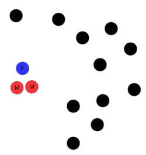

# Website for this talk

[http://nathangeffen.webfactional.com/partnermatching/partnermatching.html](http://nathangeffen.webfactional.com/partnermatching/partnermatching.html)

- Too much to cover in 10 minutes
- This presentation is bird's eye view
- Webpage has details
- Perhaps seminar

# Aim

- Microsimulation of HIV epidemic gives rich insights
- We want:
    - Monte Carlo simulation to calculate confidence intervals
	- Convenient high-level language programming
	- Visualisations on the web using Javascript

- BUT: It is too slow
- Partner matching is the bottle-neck
- **Find faster ways of doing partner matching**

# Methodology

- Define three partner matching algorithms
- Define two reference algorithms to compare these with:
    - Quality: One very slow producing nearly ideal matches
	- Speed: One very fast producing random matches
- Define measure of quality
- Analyse mathematically
- Compare empirically in multiple tests

# Typical discrete time microsimulation

~~~~~~~~~{#mycode .python}
for each time-step
    ----------------
	for each event E
		for each agent A
			if E should be applied to A
				apply E to A
	-----------------
~~~~~~~~~

# Algorithm efficiency

-  $O(n)$ vs $O(n^2)$

|     $n$    | $n \log{n}$   |        $n^2$       |
|-----------:|--------------:|-------------------:|
|         10 |            33 |                100 |
|        100 |           664 |             10,000 |
|      1,000 |         9,966 |          1,000,000 |
|     10,000 |       132,877 |        100,000,000 |
|    100,000 |     1,660,964 |     10,000,000,000 |
|  1,000,000 |    19,931,569 |  1,000,000,000,000 |

# Graphically depicted

# Typical agent attributes for partner matching

- age
- sex
- desire for new partnership
- riskiness (including whether agent is a sex worker)
- relationship status (including whether agent is married)

# Typical simulation details

- Time-scale: 1 week
- All agents examined to see who is forming new partnerships.
- Agents can acquire new high or low risk partner
- Marriage affects partner selection

# Euclidean plane

- Mapping agents to Euclidean plane would help
- Efficient nearest neighbour approximation algorithms
    - Locality-sensitive hashing
    - Best bin first
    - Balanced box decomposition

# Euclidean space doesn't work for us

Triangle rule of metric spaces violated:
$$d(x,z) \leq d(x,y) + d(y,z)$$

<!--

- Nor does previous partner history.
- Nor does marital status
- Nor does

-->

# Distance function

- Example of distance function on webpage
- Extract from this a **cluster** function

# Algorithms

- Brute force (reference: too slow)
- Random match (reference: too hopeless)
- Random match k
- Weighted shuffling
- Cluster shuffling

# Brute force

	brute_force_match(Agents):
	// Agents is an array of agents
		shuffle(Agents)
		best = infinity
		for each agent, a, in Agents
			for each unmatched agent, b, after a in Agents
				d = distance(a, b)
				if d < best
					best = d
					best_partner = b
		    make a and best_partner partners

This is $O(n^2)$.

# Cluster shuffle match

	cluster_shuffle_match(Agents, c, k)
	// Agents is an array of agents
	// c is the number of clusters
	// k is the number of neighbours to search
    // cluster_size = number of agents / c

        calculate cluster values for all agents

		sort agents in cluster_value order

        shuffle each cluster

		for each agent
		    find best partner from k neighbours

This is $O(n \log n)$.
